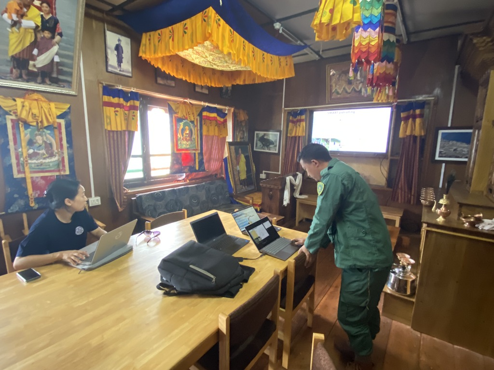
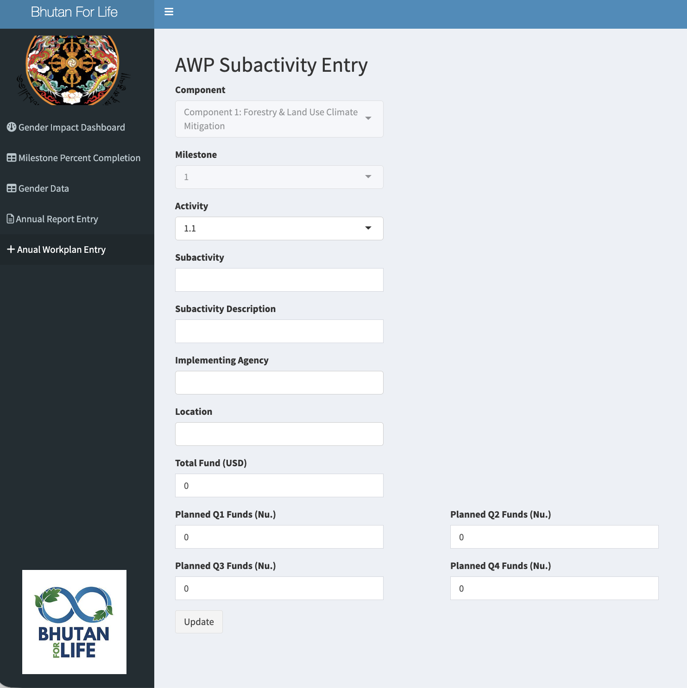

[ dashboard](https://sdorji.shinyapps.io/Reporting_backend_final/){.btn target="_blank"} [ source code](https://github.com/swdorji){.btn target="_blank"}
  
## Data Management & Project Tracking Dashboard

This data management project tracking tool was built collaboration with Bhutan for Life (BFL), a secretariat of the Royal Government of Bhutan under the patronage of her Royal Highness the Gyaltsuen. You can read more about BFL's mission to establish financing pathways for long term protection of culurally and environmentally significant conservation areas [here](/Workshops_Conferences/posts/bfl/index.html)

I designed this interface to streamline the process of recording multi-year progress on 80+ initiatives within 16 milestone areas. The dual entry sheets were designed to allow forestry officers in the field to simultaneously upload and download data from a master google sheet while simultaneously protecting the integrity of sheet data by prohibiting direct edits. The original version of the application was designed to update with new data from the master google sheet when initialized, allowing for seamless data sharing between forestry offices. The dashboard visualization shown in the linked app is a sample page that allows field and program officers to quickly visualize progress on key metrics.

Click on the R dashboard link to preview a static version of the tool with dummy data. 

::: {layout="[40, 60]"}
{fig-align="center"}

{fig-align="center"}
:::

  
