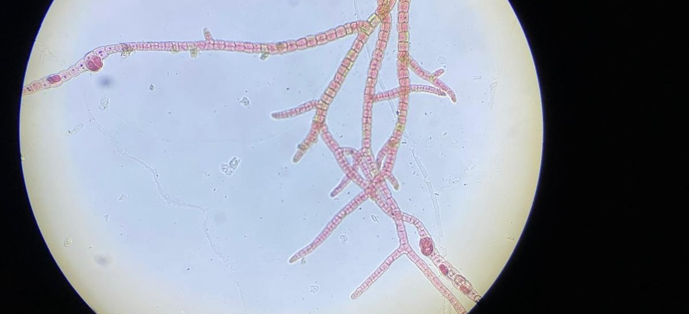

I built this microbiome visualization tool as a part of a larger metagenomic project at the aquaculture and climate technology startup [Symbrosia](https://www.symbrosia.co). The R&D team used this tool to visualize the holobiont composition of the macroalgae *Asparagopsis taxiformis* and build correlations between community composition and key production performance indicators. 

I designed a specialized protocol for DNA extraction and metagenomic shotgun sequencing with a 16s metabarcode to produce the data used in this plot. Final product visualization was built using plotly.js libraries, and culture replicate names have been anonymized to protect intellectualy property.  

<iframe src="interactive_barplotv2.html" width="125%" height="500px" style="border:none;"></iframe>

 <figure style="text-align: center; max-width: 100%;">
    
    <figcaption><em>Reproductively active A. taxiformis tetrasporophyte under microscopy</em></figcaption>
  </figure>

