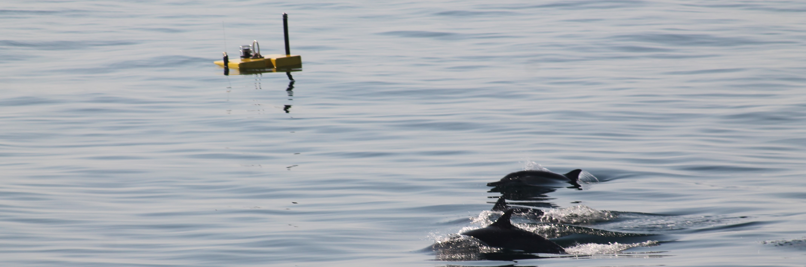
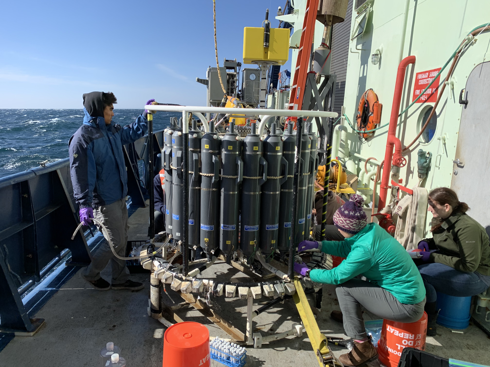

  <figure style="text-align: center; max-width: 100%;">
    
    <figcaption><em>Racing a few common dolphins to our core samples</em></figcaption>
  </figure>
  

### Field Research

Supported by the CREATE Fellowship for Ecological Research, I embarked on a research cruise aboard the R/V Atlantis. This two research cruise was conducted in partnership with UCLA and WHOI around the Santa Barbara Basin. The goal of this NSF funded expedition was to map microbial communities in the anoxic zone of the Santa Barbara Basin. Supporting research for this expedition included nutrient cycling in the sediment, characterization of mesopelagic microbial enzyme production, and bathymetric mapping. Both the ROV JASON and the AUV SENTRY were the primary vehicles used to aid in these investigations. 

### Raca-Con

I presented my research at the 2019 Research and Creative Activities Conference, where I shared findings from an investigation into the biogeochemical cycling of alkane compounds in the global ocean. The focus of my study was to better understand how naturally occurring hydrocarbons are metabolized by marine microorganisms, particularly in the mesopelagic zone, a region of the ocean that plays a critical role in carbon cycling.

By analyzing metagenomes from the Tara Oceans Database in addition to field-collected data, I identified the abundance and distribution of key hydrocarbon-degrading enzymes across different bacterial genera. This allowed for insights into the geographic variability of microbial metabolic potential, highlighting specific hotspots of enzymatic activity and microbial adaptation. The research integrated **bioinformatics**, **geographic information systems (GIS)**, and **statistical modeling** to map enzyme prevalence. This work contributes to our broader understanding of microbial ecosystem services and the ocean’s capacity to cycle anthropogenic and naturally occurring hydrocarbons.

 ---

### Media

  <figure style="text-align: center; max-width: 45%;">
    
    <figcaption><em>When the CTD Rosette calls, you answer</em></figcaption>
  </figure>

  <figure style="text-align: center; max-width: 45%;">
    
    <figcaption><em>Recovering ROV Jason after a long dive</em></figcaption>
  </figure>

