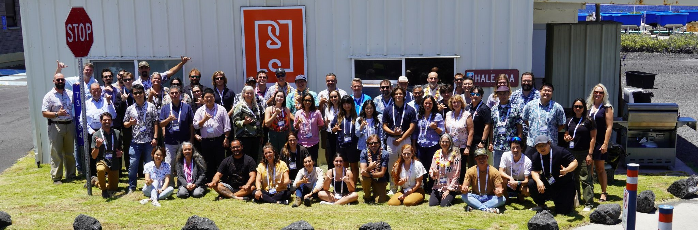
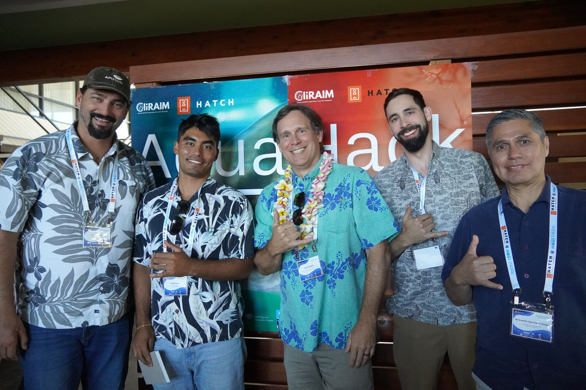

  <figure style="text-align: center; max-width: 100%;">
    
    <figcaption><em>Workshop attendees posing for a photo in front of the Hawai‘i Ocean Science and Technology (HOST) Campus</em></figcaption>
  </figure>
  

**Aquahack** was a one-day intensive hackathon held in Kona, Hawai‘i, that brought together a mix of leaders and innovators from marine technology, food security, impact finance, and academia. The event aimed to spark new ideas and  collaboration for sustainable business solutions rooted in Hawai‘i’s blue economy. Set against the backdrop of the islands’ deep cultural and ecological heritage, AquaHack focused on leveraging science, entrepreneurship, and community knowledge to create positive social, environmental, and economic impact.

Participants were grouped into interdisciplinary teams of 3–5 people, combining diverse skill sets and experiences to co-create business models that could  be implemented on one of the Hawaiian islands. These models were developed through the lenses of both scientific rigor and cultural stewardship. Throughout the day, teams received guidance from mentors in industry and academia.

Our team developed a real-time digital marketplace designed for small-scale agricultural and aquacultural producers to sell a wide range of raw inputs. The platform aimed to improve access to locally produced, organic commodities across the Hawaiian islands by strengthening direct connections between producers and consumers. Currently, inefficiencies in local distribution make it difficult for buyers to find suppliers, and vice-versa, forcing many consumers to rely on imported goods. This drives up prices and contributes to food insecurity. Our solution sought to streamline these connections, reduce dependence on imports, and support a more resilient, island-based food system. We grounded our proposal in local community needs and ecological realities, seeking to align economic opportunity with traditional knowledge. 

AquaHack not only provided a space for creative problem-solving but also laid the foundation for long-term partnerships and real-world projects that  are supporting Hawai‘i’s economic diversification and resilience.

{width=75% fig-align="center"}

### Media 

- April 24, 2024 -  [University of Hawai'i News](https://www.hawaii.edu/news/2024/04/25/aquahack-workshop/)
