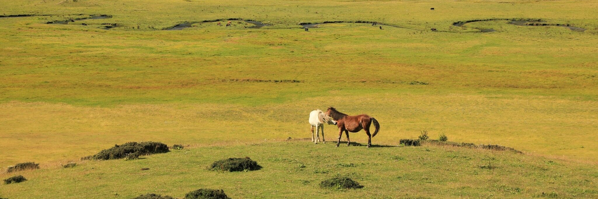
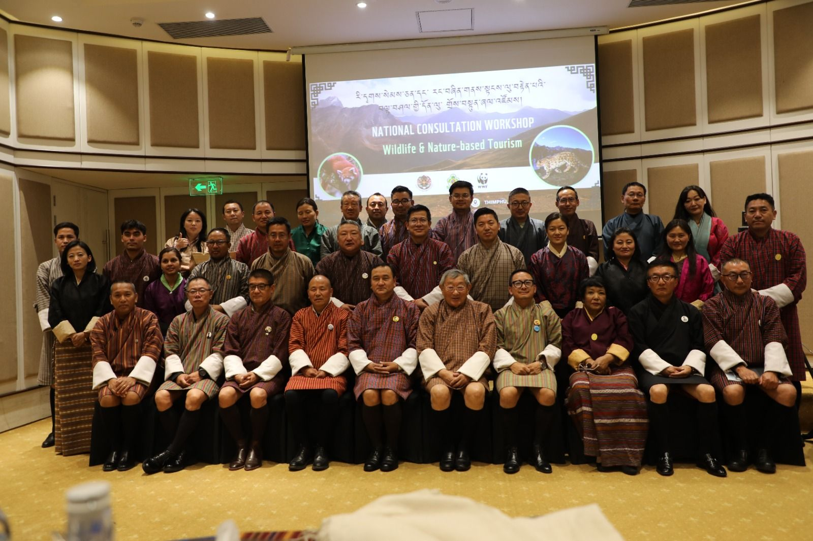

  <figure style="text-align: center; max-width: 200%;">
    
    <figcaption><em>Two mustangs play in the Phobjikha Valley protected wetlands</em></figcaption>
  </figure>
  

### Bhutan for Life
Established by the Royal Charter of His Majesty the 5th King of Bhutan, Bhutan for Life (BFL) is a initiative tasked with securing long-term funding that ensures **carbon neutrality**, **preservation of biodiversity**, and access to **sustainable livelihoods** for the kingdom and its citizens. BFL operates in all the Protected Areas, Biological Corridors, and Botanical Parks within Bhutan ; a scope of operations that covers 55% of the country. Established via a public-private partnership between the **Green Climate Fund**, **Royal Government of Bhutan**, and **private donors** - Bhutan for Life has a mandate to secure sustainable revenue streams for the continued protection of these parks. As the first **Project Finance for Permanence (PFP)** project in Asia, BFL is ensuring the long term management through climate-smart restoration and capacity building of sustainable revenue streams in rural communities. 

### National Consulation Workshop

On April 14, 2025, we convened with leaders from the Department of Tourism, WWF Bhutan, the Forestry Service, and private industry to discuss the future of sustainable development in Bhutan’s protected areas. Experts in wildlife biology, conservation, and rural development came together to explore strategies that balance equitable livelihoods for local communities with the preservation of iconic keystone species such as the golden mahseer, snow leopard, and Bengal tiger. Central to the discussion was the feasibility of implementing **biodiversity credits** and **debt-for-nature swaps**, as well as developing low-impact infrastructure to support **ecotourism**. Stakeholders from across the Dzongkhags were present to ensure that community perspectives were prioritized in all the proposed solutions.

