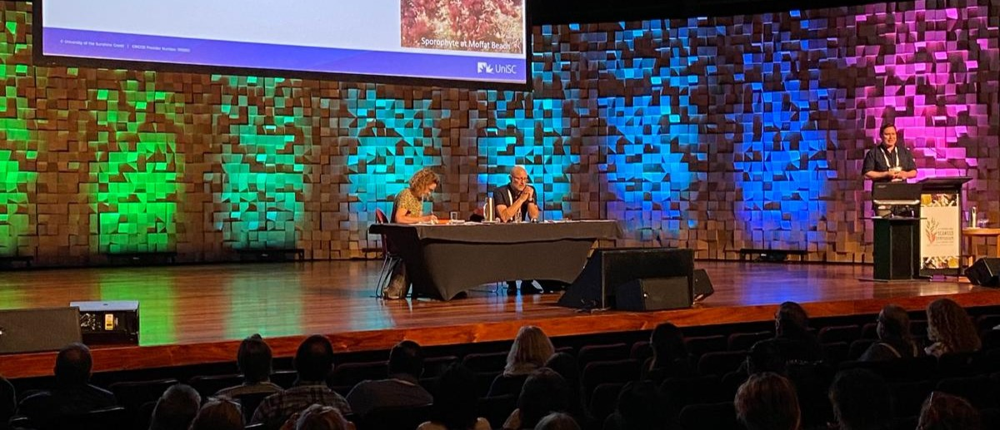
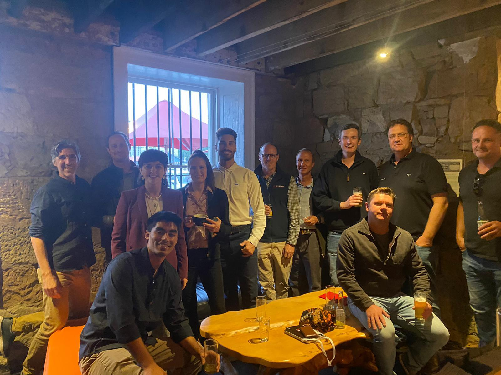

  <figure style="text-align: center; max-width: 200%;">
    
    <figcaption><em>Plennary session on *Asparagopsis* genomics </em></figcaption>
  </figure>
  

### The 24th International Seaweed Symposium

The International Seaweed Symposium (ISS) is a biennial gathering of leading researchers, industry innovators, and policymakers from around the world, dedicated to advancing the science and application of seaweed. This year’s event, held in Hobart, Tasmania, brought together over 780 participants representing 48 countries. The symposium served as a platform for sharing the latest research in phycology, exploring new technologies, and fostering collaboration.

One of the central themes this year was the rapid growth of the *Asparagopsis* industry, recognized as one of the most promising natural solutions to reduce greenhouse gas emissions from the livestock sector. *Asparagopsis* cultivation and commercialization took center stage in technical sessions and industry panels for its methane-reducing properties. The ISS served as a meeting place for key players in the space, including *FutureFeed*, *CH4 Global*, *Greener Grazing*, and *Sea Forest*.

I attended ISS as a representative of the Hawaiʻi-based **Symbrosia**, a startup helping pioneer the industry. My role involved promoting our technological differentiation, particularly innovations in strain selection and cultivation systems. I also gathered insights from the latest research and technical advancements to bring back to our operations. 

The symposium offered a valuable opportunity to position Symbrosia within the global conversation and to deepen our engagement with the scientific and business communities shaping the future of seaweed innovation.. 
 
 

  <figure style="display: inline-block; max-width: 60%;">
    
    <figcaption style="font-weight: normal;"><em>A friendly meeting between industry representatives in a historic part of Hobart</em></figcaption>
  </figure>

